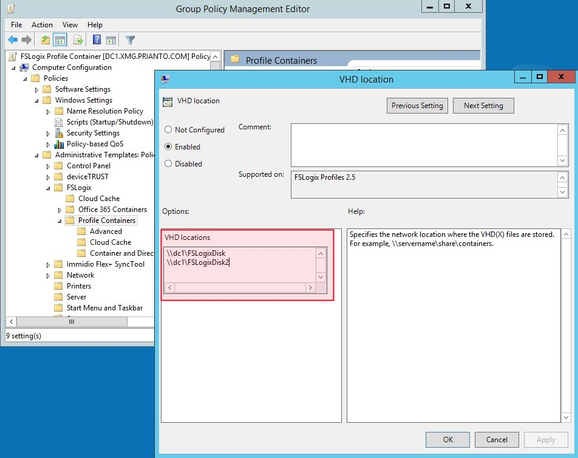

# FSLogix GPO Template

This is a GPO Template for [FSLogix](https://fslogix.com) settings.

It fixes a current issue of the `VHDLoctaions` settings in the FSLogix Profile Container settings.

This fix applys to **FSLogix Apps 2.9.4 (2.9.6842.37624)**

The default GPO causes the setting to result in a REG_SZ in the registry, which causes issues.
According to [FSLogix documention](https://docs.fslogix.com/display/20170529/FSLogix+Profiles+Configuration+Settings) the seeting should be of type REG_MULTI_SZ.

 